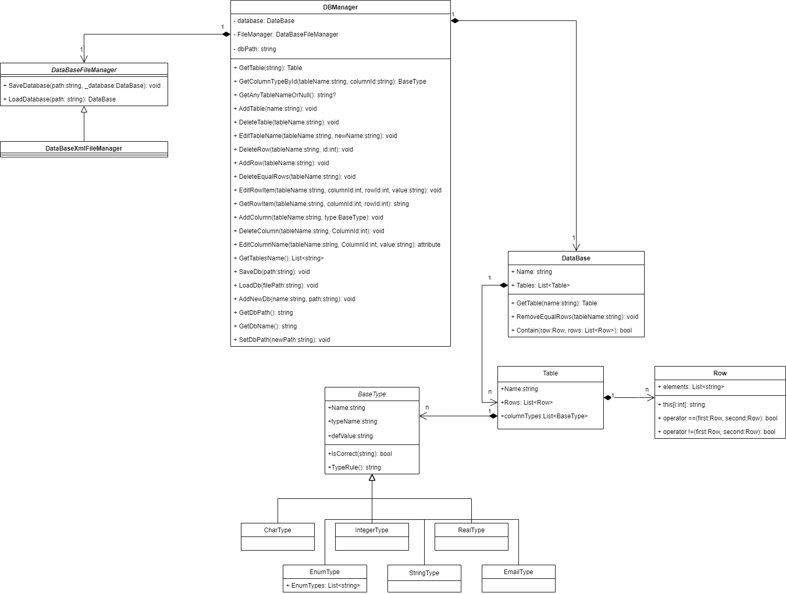

# Розробка локальної версії СУТБД

# Етап 1: 

* Розробка класів для понять "Таблиця", "База" та, можливо, деяких інших класів, спряжених із поняттям "Таблиця".
* Створення UML-діаграми класів (з наявними між класами відношеннями).

### діаграма класів

Опис класів:

**BaseType** – абстрактний клас для представлення типу даних стовпця в таблиці. Класи **CharType**, **IntegerType**, **EnumType**, **StringType**, **EmailType**, **RealType** – відображають типи, що передбачені в умові проекту. Валідація кожного типу даних відбувається за допомогою методу isCorrect, він реалізується кожним нащадком окремо.

**Row** – клас для представлення рядків таблиці.

**Table** – Клас для представлення таблиці.

**DataBase** – Клас для представлення бази даних.

**DBManager** – Клас, що надає основний функціонал для роботи з базою даних. Надає інтерфейс для створення, видалення, редагування таблиці/рядків/БД, а також включає клас DataBaseFileManager для збереження і завантаження бази даних.

**DataBaseFileManager** – абстрактний клас для збереження/завантаження бд в локальні файли. DataBaseXMLFileManager його реалізація для роботи з файлами типу ".xml".

# Етап 2: 

* Забезпечення інтерфейсу користувача на основі форм.
* Проведення unit-тестування. Надати 3..* тести, один з яких має бути призначеним для тестуванням операції видалення повторюваних рядків.

