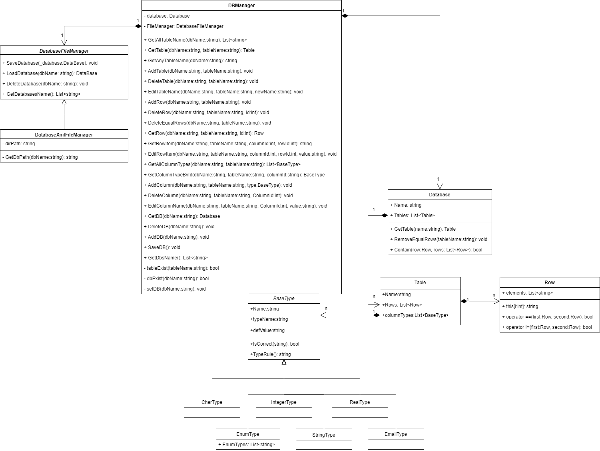
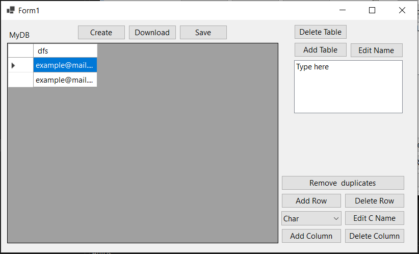
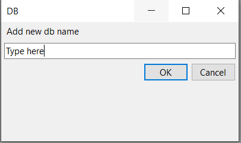
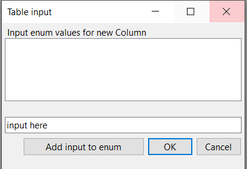

# Розробка локальної версії СУТБД

# Етап 1: 

* Розробка класів для понять "Таблиця", "База" та, можливо, деяких інших класів, спряжених із поняттям "Таблиця".
* Створення UML-діаграми класів (з наявними між класами відношеннями).

### діаграма класів

Опис класів:

**BaseType** – абстрактний клас для представлення типу даних стовпця в таблиці. Класи _**CharType**_, _**IntegerType**_, _**EnumType**_, _**StringType**_, _**EmailType**_, _**RealType**_ – відображають типи, що передбачені в умові проекту. Валідація кожного типу даних відбувається за допомогою методу isCorrect, він реалізується кожним нащадком окремо.

**Row** – клас для представлення рядків таблиці.

**Table** – Клас для представлення таблиці.

**DataBase** – Клас для представлення бази даних.

**DBManager** – Клас, що надає основний функціонал для роботи з базою даних. Надає інтерфейс для створення, видалення, редагування таблиці/рядків/БД, а також включає клас DataBaseFileManager для збереження, завантаження, видалення та створення бази даних.

**DataBaseFileManager** – абстрактний клас для збереження/завантаження бд в локальні файли. **DataBaseXMLFileManager** його реалізація для роботи з файлами типу ".xml".

Реалізацію класів можна побачити за [посиланням](https://github.com/Forgefill/TTP-41_IT_Course_Project/tree/master/DAL)

# Етап 2: 

* Забезпечення інтерфейсу користувача на основі форм.
* Проведення unit-тестування. Надати 3..* тести, один з яких має бути призначеним для тестуванням операції видалення повторюваних рядків.

## інтерфейс користувача(WinForm)

Інтерфейс користувача реалізовано за допомогою **Windows Forms** — це інтерфейс програмування додатків, відповідальний за графічний інтерфейс користувача і є частиною Microsoft .NET Framework.

Створений інтерфейс користувача, для доступу до СУТБД, має настуний вигляд:

Для відображення таблиць було використано елемент ListBox, Для роботи з рядками/стовпчиками елемент DataGridView.

Користувачу надано доступ до наступних дій:
* Операції збереження, завантаження, створення бази даних
* Операції створення, завантаження(DoubleClick на назву таблиці в ListBox), редагування імені, видалення таблиці.
* Створення стовпчиків, рядків.
* Видалення стовпчиків, рядків та рядків що повторюються(за Реляційною алгеброю)
* Редагування вмісту таблиці(DataGridView), назв стовчиків.

для введення імен бази даних, таблиці, стовпчика використовується додаткова форма:

для введеня списку для перелічуваного типу даних використовується форма:

Програмна частина з'єднує бізнес логіку класа DBManager вказаного на діаграмі класів і можливості WinForm. 
Код проекту можна переглянути [на github](https://github.com/Forgefill/TTP-41_IT_Course_Project/blob/master/LocalDB/Form1.cs).
## Unit-test

Для тестування бізнес логіки класу DBManager створено три unit-тести:

* TestAddDelete
Тестуємо операції створення, видалення, оновлення, доступу для заданої моделі даних.
* TestRemoveEqualRow
Тестуємо операцію видалення повторюваних рядків
* TestSaveLoadDB
Тестуємо збереження і завантаження бази даних з диску.

Код тестів можна переглянути за [посиланням](https://github.com/Forgefill/TTP-41_IT_Course_Project/blob/master/DBTest/UnitTest1.cs).

Етап 3
