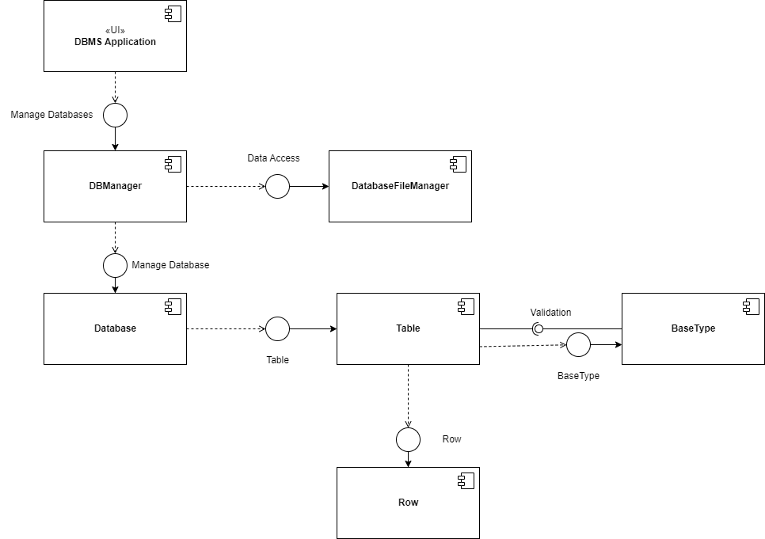
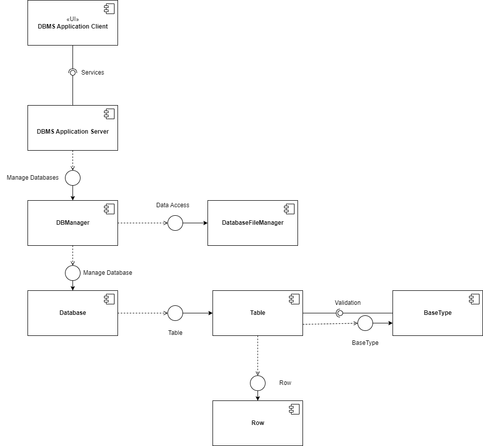
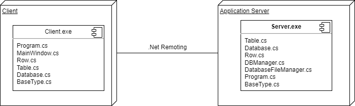

# Використання UML при проектуванні та специфікації програмних систем
## Діаграма прецедентів

### Потоки подій:
#### Потік подій для прецедента "Створити БД"
* Користувач натискає кнопку "Create"(А1).
* Користувач вводить назву Бази даних у вікні, що з'виться.
* Користувач натискає кнопку "Ок"(А2, А3).
* Створюється БД.
* Варіант використання завершується.    
**Альтернативні потоки:**    
А1. Повернення в головне меню
* Користувач закриває вспливаюче вікно.
* Потік повертається на етап 1 основного потоку.  
А2. База даних з такою назвою вже існує  
* Система виводить повідомлення з помилкою.
* Потік повертається на етап 2 основного потоку.  
А3. Назва бази даних не допустима.  
* Система виводить повідомлення з помилкою.
* Потік повертається на етап 2 основного потоку.
#### Потік подій для прецедента "Видалити рядки, що повторюються"
* Користувач обирає базу даних.
* Користувач обирає таблицю.
* Користувач натискає кнопку "Remove equals row"(A1).    
#### Потік подій для прецедента "Додати таблицю"
* Користувач відкриває базу даних. 
* Користувач натискає кнопку "Add table"(А1).
* Користувач вводить назву таблиці в вікні, яке з'явилося(А2, А3).
* Користувач натискає кнопку Ок.    
**Альтернативні потоки:**    
A1. Повернення в головне меню
* Користувач закриває вспливаюче вікно.
* Потік повертається на етап 2 основного потоку.  
A2. Таблиця вже існує
* Система виводить повідомлення про те, що таблиця з такою назвою вже існує в цій базі даних.
* Потік повертається на етап 3 основного потоку.  
A3. Назва таблиці введена некоректно
* Система виводить повідомлення про помилку.
* Потік повертається на етап 3 основного потоку

## Діаграма класів

## VOPC-діаграма для прецедента "Видалити рядки, що повторюються"

## Діаграми взаємодії

### Create database

### Load database

### Remove equal rows

### Add table

## Діаграми компонентів

### Для нерозподіленої системи

### Для розподіленої системи

## Діаграма розгортання

