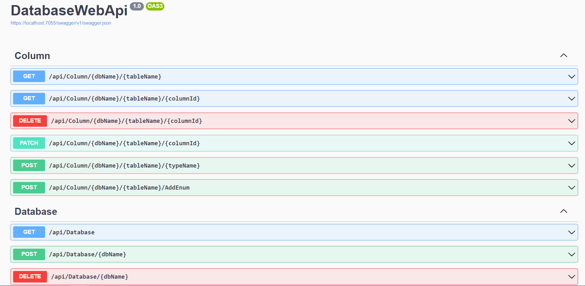
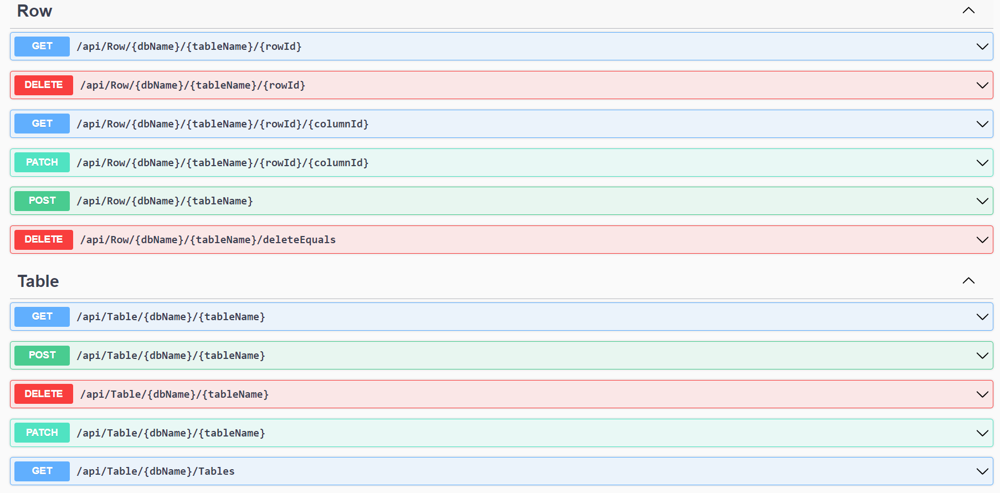

[Сторінка проекту](https://github.com/Forgefill/TTP-41_IT_Course_Project)

# Rest web-сервіси
# Розробка OpenApi Specification
# Asp.Net Web Api

Створимо Asp.Net Web Api проект та додамо в нього підтримку OpenApi. Також зареєструємо DBManager в DI контейнері.
```C#
using DAL;
using DAL.DBFileManagers;

var builder = WebApplication.CreateBuilder(args);

// Add services to the container.

builder.Services.AddSingleton<DBManager>();
builder.Services.AddControllers();
// Learn more about configuring Swagger/OpenAPI at https://aka.ms/aspnetcore/swashbuckle
builder.Services.AddEndpointsApiExplorer();
builder.Services.AddSwaggerGen();

var app = builder.Build();

// Configure the HTTP request pipeline.
if (app.Environment.IsDevelopment())
{
    app.UseSwagger();
    app.UseSwaggerUI();
}

app.UseHttpsRedirection();

app.UseAuthorization();

app.MapControllers();

app.Run();
```
Додамо контролери з Get, Post, Patch та Delete запитами до таких сутностей як Database, Table, Column, Row. Також додамо запит для видалення рядків, що повторюються.
Отримуємо сторінку з OpenApi документацією всіх запитів.



Нижче наведено код Database контролера:
```C#
using Microsoft.AspNetCore.Http;
using Microsoft.AspNetCore.Mvc;
using DAL.DBFileManagers;
using DAL;
using DAL.DatabaseEntities;

namespace DatabaseWebApi.Controllers
{
    [ApiController]
    [Route("api/[controller]")]
    public class DatabaseController : ControllerBase
    {

        private DBManager dbManager { get; set; }

        public DatabaseController(DBManager dBManager)
        {
            dbManager = dBManager;
        }

        [HttpGet]
        public ActionResult<List<string>> GetAllDBName()
        {
            return Ok(dbManager.GetDbsName());
        }

        [HttpPost("{dbName}")]
        public ActionResult PostDatabase(string dbName)
        {
            try
            {
                dbManager.AddDB(dbName);
            }
            catch(Exception ex)
            {
                return BadRequest(ex.Message);
            }

            return Ok();
        }

        [HttpDelete("{dbName}")]
        public ActionResult DeleteDatabase(string dbName)
        {
            try
            {
                dbManager.DeleteDB(dbName);
                return Ok(dbName);
            }
            catch(Exception ex)
            {
                return NotFound(ex.Message);
            }

            return NoContent();
        }

    }
}
```
код всього веб-апі можна переглянути за [посиланням](https://github.com/Forgefill/TTP-41_IT_Course_Project/tree/master/DatabaseWebApi).

[Сторінка проекту](https://github.com/Forgefill/TTP-41_IT_Course_Project)
