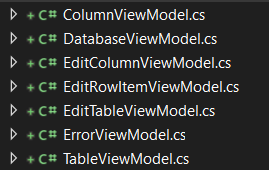

[Сторінка проекту](https://github.com/Forgefill/TTP-41_IT_Course_Project)

# ASP.NET web MVC

Створено проект системи управління бази даних з використанням технології Asp.Net MVC. Використано модель створену під час виконання [етапу 1](https://github.com/Forgefill/TTP-41_IT_Course_Project/tree/master/DAL), а також створено наступний комплект ViewModels, які агрегують частину даних, щоб не передавати всю базу даних у непотрібні місця, і прив'язані до відповідних view.

Створено три контролери, що відповідають за зв'язок між моделями бази і view, що отримує клієнт, а саме:
* DatabaseController;
* TableController;
* ContentController;

Контролери повністю реалізують інтерфейс, що описаний в [Use-Case](https://github.com/Forgefill/TTP-41_IT_Course_Project/blob/master/img/UseCase0.png) діаграмі проекту.
Конкретний код можна переглянути за посиланням

[Сторінка проекту](https://github.com/Forgefill/TTP-41_IT_Course_Project)
