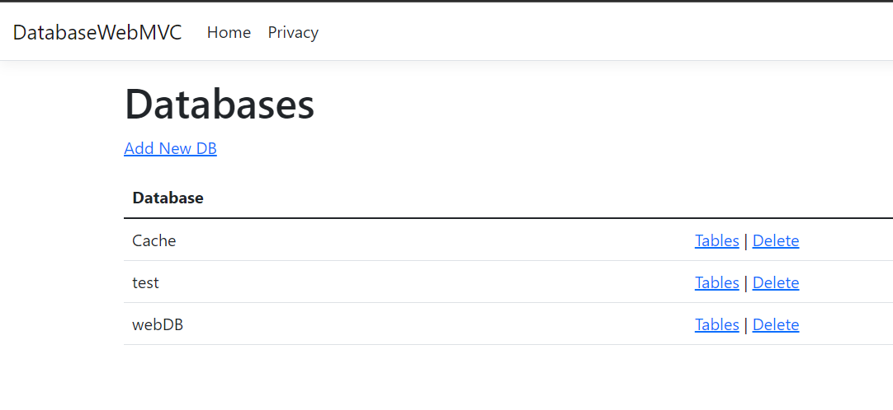
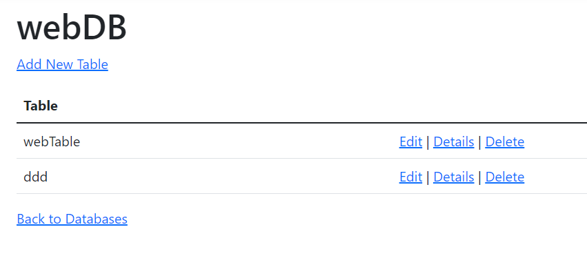
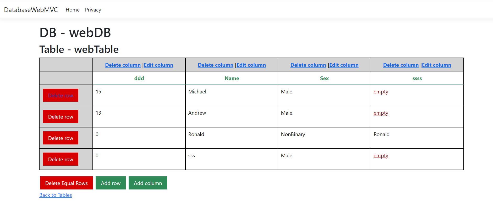
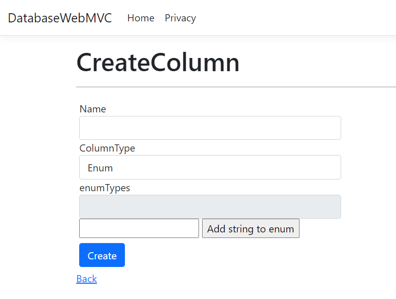

[Сторінка проекту](https://github.com/Forgefill/TTP-41_IT_Course_Project)

# ASP.NET web MVC

Створено проект системи управління бази даних з використанням технології Asp.Net MVC. Використано модель створену під час виконання [етапу 1](https://github.com/Forgefill/TTP-41_IT_Course_Project/tree/master/DAL), а також створено наступний комплект ViewModels, які агрегують частину даних, щоб не передавати всю базу даних у непотрібні місця, і прив'язані до відповідних view.

Для збереження баз даних використано клас DBManager створений на [етапі локальної СКБД](https://github.com/Forgefill/TTP-41_IT_Course_Project/blob/master/docs/stage%201-2.md). Його зареєстровано в класі Startup і використовуючи DI використано в контролерах проекту.

Створено три контролери, що відповідають за зв'язок між моделями бази і view, що отримує клієнт, а саме:
* DatabaseController;
* TableController;
* ContentController;

Контролери повністю реалізують всі події, що описаний в [Use-Case](https://github.com/Forgefill/TTP-41_IT_Course_Project/blob/master/img/UseCase0.png) діаграмі проекту.
Конкретний код можна переглянути за [посиланням](https://github.com/Forgefill/TTP-41_IT_Course_Project/tree/master/DatabaseWebMVC/Controllers).

## Список баз даних:

## Таблиці конкретної БД:

Веб-сторінки видалення БД/таблиці та редагування назв тривіальні.

## Перегляд таблиці і операції над рядками та стовпчиками:

## Додавання стовпчиків:

[Сторінка проекту](https://github.com/Forgefill/TTP-41_IT_Course_Project)
